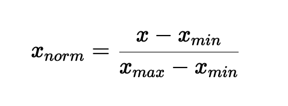
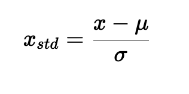
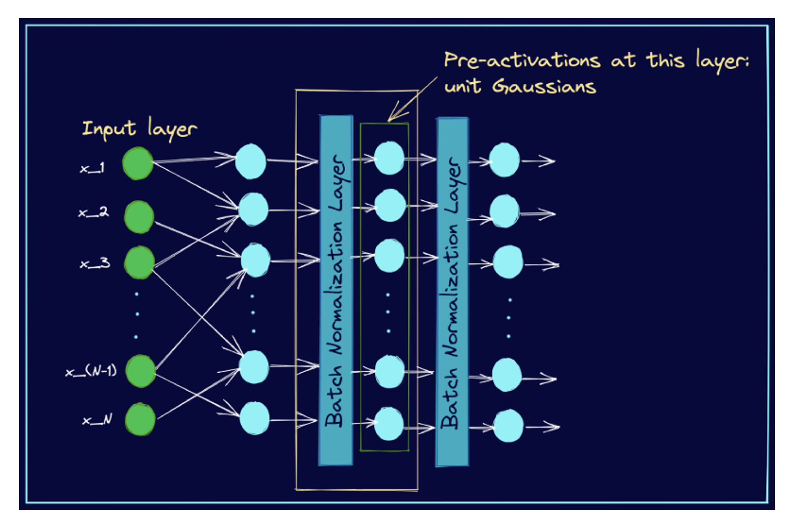
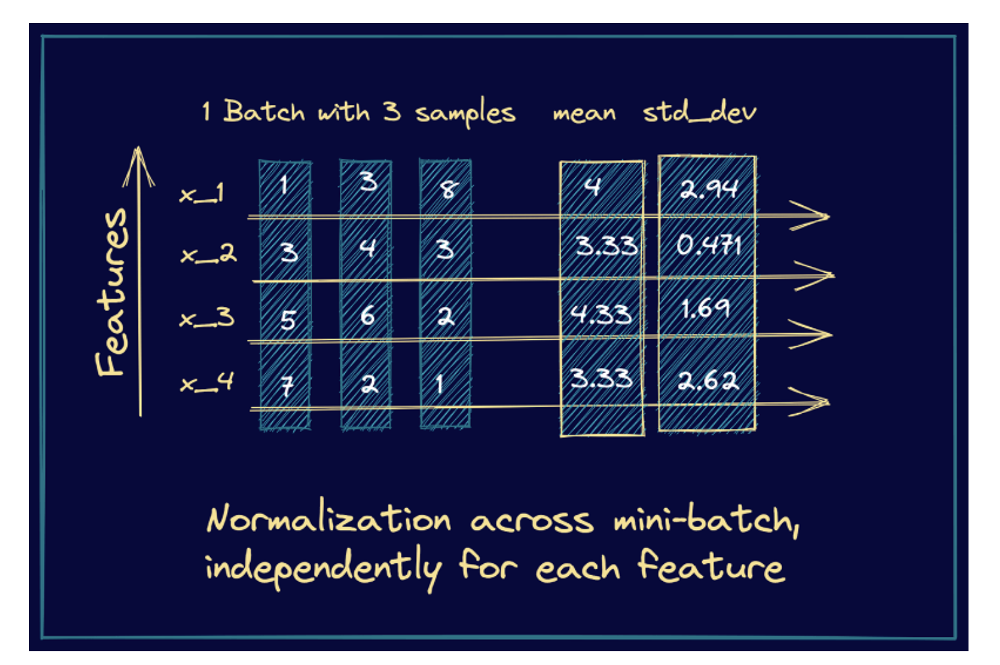
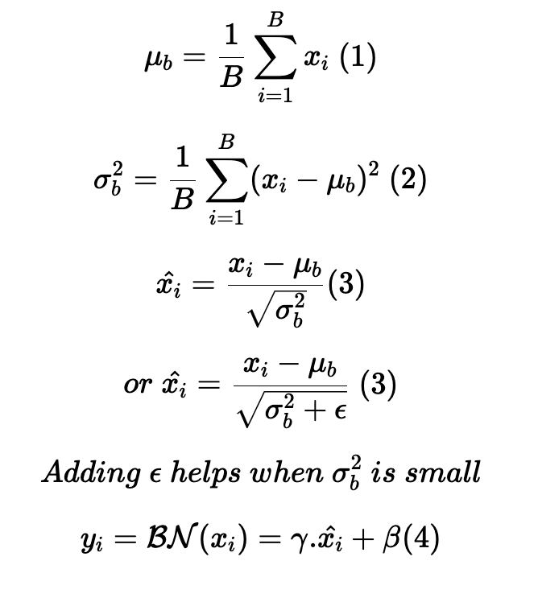
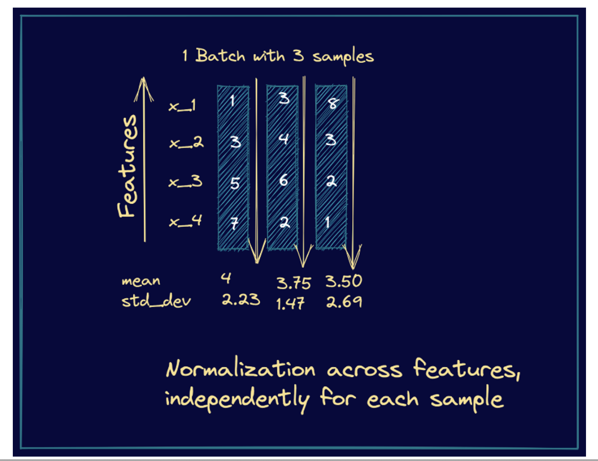
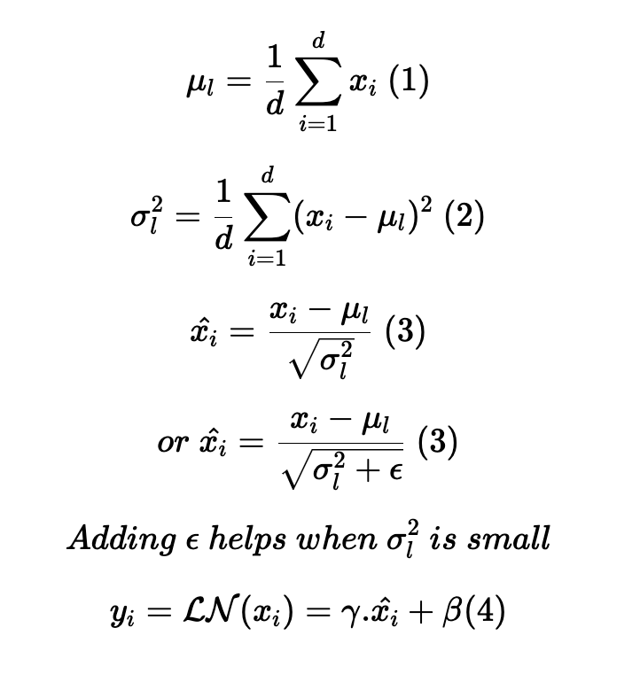

# BigramLanguageModel

## self.token_embedding_table = nn.Embedding(vocab_size, n_embd)

This line creates an embedding layer for tokens (words or subwords, depending on how you preprocess your text). The vocab_size parameter specifies the size of your vocabulary, and n_embd specifies the dimensionality of the embeddings. This layer converts token indices into dense vectors of fixed size.

Certainly! Let's dive deeper into the explanation of this line:

```python
self.token_embedding_table = nn.Embedding(vocab_size, n_embd)
```

This line of code initializes an embedding layer within a neural network model that is specifically designed for processing sequences of tokens, such as words or subwords in text. Let's break down the components and the concepts involved:

1. **`nn.Embedding`:** This is a class provided by PyTorch's neural network module (`torch.nn`). An embedding layer is essentially a lookup table that maps integer indices (which represent specific tokens in your vocabulary) to dense, high-dimensional vectors. These vectors are trainable parameters of the model, which means they are adjusted during the training process to help the model perform better on its task.

2. **`vocab_size`:** This is the size of your vocabulary. The vocabulary is a collection of all the unique tokens (e.g., words or subwords) that your model knows about and can process. The size of the vocabulary is the number of unique tokens it contains. Each token in your vocabulary is assigned a unique integer index. The `vocab_size` parameter tells the embedding layer how many different tokens it needs to be able to represent.

3. **`n_embd`:** This parameter specifies the dimensionality of the embedding vectors. In other words, each token indexed by the embedding layer is represented as a dense vector of `n_embd` floating-point numbers. These numbers capture semantic and syntactic aspects of the token in a high-dimensional space. For example, if `n_embd` is set to 100, then each token in your vocabulary is represented by a vector of 100 numbers.

4. **How it works:** When you pass integer indices (token IDs) into this embedding layer, it returns the corresponding embedding vectors. For instance, if you pass the integer index for the word "cat," the embedding layer looks up this index in its table and returns the dense vector associated with "cat." These vectors are learned during training, allowing the model to capture rich, token-specific information that is useful for the task at hand, whether it be language modeling, text classification, or another NLP task.

5. **Purpose and benefits:** The main purpose of using an embedding layer is to convert sparse, one-hot encoded representations of tokens into dense, lower-dimensional, and continuous vectors. These dense embeddings are more efficient and effective for neural networks to process and can capture relationships between tokens (e.g., semantic similarity) in a way that discrete representations cannot.

In summary, the embedding layer represented by this line of code is a fundamental building block in natural language processing models. It provides a way to map discrete tokens into a continuous vector space, enabling the model to learn and leverage the rich and nuanced information contained in text.

## Some more on vocab_size

In the context of `self.token_embedding_table = nn.Embedding(vocab_size, n_embd)`, the `vocab_size` parameter is directly related to the integer indices (token IDs) you pass into the embedding layer. Let me clarify how `vocab_size` functions in this scenario:

1. **Definition of `vocab_size`:** The `vocab_size` parameter specifies the total number of unique tokens that the embedding layer can handle. This is the size of your model's vocabulary, meaning all the distinct words, subwords, or characters (depending on your tokenization approach) that your model is designed to recognize and process.

2. **Role of `vocab_size` in Embedding Layer:** The embedding layer, initialized with a `vocab_size`, creates a matrix of shape `[vocab_size, n_embd]`. Each row in this matrix corresponds to one token in the vocabulary, and `n_embd` is the dimensionality of the embedding vectors. The index of the row corresponds to the integer index (token ID) of a token in the vocabulary.

3. **Mapping Integer Indices to Embedding Vectors:** When you pass integer indices (token IDs) into the embedding layer, each index is used to look up the corresponding row in the embedding matrix. This row is the embedding vector for that token. The process is efficient and allows for fast retrieval of embeddings during model training and inference.

4. **Importance of `vocab_size`:** By defining `vocab_size`, you are essentially setting the limit on the number of unique tokens the embedding layer can recognize. An attempt to access an index greater than `vocab_size - 1` would result in an error because it would be outside the bounds of the embedding matrix. The size of your vocabulary (`vocab_size`) needs to be carefully chosen to encompass all the tokens you expect to encounter in your dataset, plus potentially special tokens (like padding, start-of-sequence, end-of-sequence).

In essence, `vocab_size` is a critical parameter that defines the "width" of the embedding matrix, enabling the mapping of token IDs to their respective embedding vectors. Each token ID (an integer index) you pass into the embedding layer is directly used to fetch the embedding vector at that index in the embedding matrix, where the matrix has one row for each token in the vocabulary up to `vocab_size`.

## self.position_embedding_table = nn.Embedding(block_size, n_embd)

This creates another embedding layer, this time for positions within a sequence. block_size is the maximum length of the sequences you're dealing with, and n_embd is again the dimensionality of the embeddings. This allows the model to learn the positional importance of a token within a sequence.

Let's take a sentence:

Quick brown fox jumped over the lazy dog.

Let's say this is my text, and also since each word is unique, the vocab_size would 8 since there are 8 words. Let's say I am dealing with character tokens to simplify. So we can take an example of how the token and position embedding tensors look like if n_embd is 5.

```
# Update the vocabulary to include space and correct the vocab size
vocab = {
    ' ': 0, 'Q': 1, 'u': 2, 'i': 3, 'c': 4, 'k': 5,
    'b': 6, 'r': 7, 'o': 8, 'w': 9, 'n': 10,
    'f': 11, 'x': 12, 'j': 13, 'm': 14, 'p': 15,
    'e': 16, 'd': 17, 'v': 18, 't': 19, 'h': 20,
    'l': 21, 'a': 22, 'z': 23, 'y': 24, 'g': 25, '.': 26}

vocab_size = len(vocab)  # Updated unique characters including space and period
sentence = "Quick brown fox jumped over the lazy dog."

# Update tensors for character indices and positions
char_indices = [vocab[c] for c in sentence]
positions = list(range(len(sentence)))

# Re-initialize embeddings with updated vocab size
token_embedding = torch.nn.Embedding(vocab_size, n_embd)
position_embedding = torch.nn.Embedding(len(sentence), n_embd)

# Generate embeddings again
token_embeddings = token_embedding(torch.tensor(char_indices))
position_embeddings = position_embedding(torch.tensor(positions))

token_embeddings, position_embeddings
```

How did it generate these numbers from the positions? I need to understand the underlying mechanism. Are these just random numbers?

The position embeddings you see, such as:

```
tensor([[ 1.1492,  0.7834,  1.0066,  0.7531,  0.1982],
        [ 0.0855,  0.3473, -1.8594,  0.3003, -0.2586],
        [ 1.6942,  0.4230, -1.1186,  0.6784,  0.1675],
        ...
        [-1.5649,  0.7392,  1.3142, -0.3011,  1.5812]],
       grad_fn=<EmbeddingBackward0>)
```

are indeed initialized with random numbers. Here's the underlying mechanism and why these initial values are randomized:

### Embedding Initialization
- **Random Initialization:** When the embedding layer is created with `torch.nn.Embedding`, its weights (which serve as the embedding vectors for each position in this case) are initialized randomly. This random initialization is a common practice in deep learning as it breaks symmetry and allows the model to learn different features for different positions during the training process.

### Learning Process
- **Learning from Data:** During training, these embedding vectors are adjusted through backpropagation based on the loss between the model's predictions and the actual outputs. The model learns to assign more meaningful values to these vectors, capturing the positional information that influences the sequence's meaning.

### Purpose of Position Embeddings
- **Encoding Positional Information:** The purpose of these position embeddings is to provide the model with a way to understand the order of tokens in a sequence. Since models like transformers process input tokens in parallel, they lack a built-in mechanism to recognize the order. Position embeddings solve this by adding a unique vector to each token's embedding, thereby incorporating order information into the model's representation.

### Conclusion
The numbers in the position embeddings are initially random and do not convey meaningful positional information at the start. However, as the model is trained, these numbers are updated to reflect patterns in the data that are relevant to the task at hand, such as the importance of a word's position in understanding sentence structure or meaning. Through training, the model learns to leverage these embeddings effectively, allowing it to make better predictions or generate more coherent text based on the sequence of input tokens.

So let's take the first word Quick with it's positions:

0, 1, 2, 3, 4

Will each letter of the word have one vector? For instance they are:

[-0.2942, -0.0708, -0.0866,  1.1781, -0.2207],
        [ 0.3161, -0.0489,  0.9529,  0.1672, -0.4200],
        [-1.8517,  0.2120, -0.0137,  1.0037,  1.0011],
        [ 0.6654, -0.0926,  2.4918, -0.5021,  0.1979],
        [ 0.1255, -0.4765,  1.0636, -1.3583, -1.4382],

So how does the letter K's position slowly evolve and what would be it's eventual expected position vector? I mean K in this should be

 [ 0.1255, -0.4765,  1.0636, -1.3583, -1.4382]

initially. We can take an example.

The evolution of the embedding vector for a specific character, such as "K" in the word "Quick", during the training process of a neural network model, is influenced by how well the model learns to minimize its loss function—essentially improving its performance on the training data. This process involves adjusting the weights (embedding vectors) through backpropagation based on the gradients computed during training. Let's go through a simplified example of how "K"'s position vector might evolve.

### Initial Position Vector

Initially, "K"'s position vector might be randomly initialized as:

\[ [0.1255, -0.4765, 1.0636, -1.3583, -1.4382] \]

### Step-by-step Evolution

1. **Forward Pass:** In the forward pass, the model processes input data (e.g., a sentence containing the word "Quick") and generates predictions based on its current parameters, including the embedding vectors.

2. **Loss Calculation:** The model's predictions are compared to the actual target values (e.g., the next character or word), and a loss is computed, indicating how far off the predictions are.

3. **Backward Pass:** During the backward pass (backpropagation), gradients of this loss with respect to the model's parameters are calculated. These gradients indicate how each parameter (including the embedding vector for "K") should be adjusted to minimize the loss.

4. **Parameter Update:** The model's parameters are updated using an optimization algorithm (like SGD, Adam, etc.). The update to "K"'s embedding vector depends on its gradient. For instance, if the gradient indicates that increasing the first component of the vector and decreasing the second component would reduce the loss, the optimization algorithm adjusts the vector accordingly.

### Example Evolution

Assuming a very simplistic scenario and focusing only on the first two components of "K"'s embedding vector for illustration:

- After 1 epoch (a full pass through the training data), suppose the gradients indicate an increase in the first component and a decrease in the second. The updated vector might look like:
  \[ [0.1300, -0.4800, ..., ..., ...] \]

- After several epochs, as the model learns, the embedding vector for "K" continues to evolve, capturing more meaningful features that contribute to the model's task. The vector might evolve to something like:
  \[ [0.2500, -0.5000, 1.2000, -1.3000, -1.4000] \]

### Final Position Vector

Eventually, after many epochs, "K"'s position vector stabilizes as the model converges, ideally reaching a state where it effectively contributes to the model's understanding and generation of text. The final vector might look significantly different from its initial state, having adjusted to capture the nuances of "K"'s role and relationships within the text data it was trained on.

\[ [0.3500, -0.5500, 1.5000, -1.2500, -1.3000] \]

### Conclusion

The exact trajectory of "K"'s embedding vector evolution depends on various factors, including the model architecture, the complexity of the task, the nature of the training data, and the optimization algorithm. The embedding vector's final state ideally represents a rich encoding of "K"'s semantic and syntactic properties as learned from the training data, allowing the model to utilize this information for predictions or generation tasks.

So K's position vector can be used to express it's positions in terms of 5 dimensions or dimensional characteristics of it's position. Can we take an example of what these 5 dimensional characteristics could be. As in this case the number 5 was chosen by us and somehow the model assigns a certain dimensional characteristic meaning to each of these dimensions.

I am thinking one example of the dimensional characteristic for positional embedding would be:

"k usually follows c"

but not sure.

The dimensions in an embedding vector, such as the 5-dimensional vector used for "K"'s position or character embeddings, are not easily interpretable in human terms. Unlike manually crafted features where each dimension has a specific, understandable meaning (like "k usually follows c"), the dimensions of learned embeddings in deep learning models are more abstract. They represent complex patterns in the data that the model has discovered during training. However, we can still speculate on the kinds of characteristics these dimensions might capture in an abstract, high-level sense.

### Abstract Characteristics of Embedding Dimensions

1. **Character Frequency in the Language:** One dimension might capture how common the character is within the language or dataset. Frequent characters might have different values along this dimension compared to rare characters.

2. **Positional Tendency:** A dimension could encode the tendency of a character to appear in certain positions within words or sentences. For example, "k" might be more common at the beginning or middle of English words than at the end.

3. **Co-occurrence with Other Characters:** Some dimensions might capture patterns of co-occurrence with other characters. This is similar to your example of "k usually follows c" but in a more generalized and abstract manner. It could represent the likelihood of "k" appearing near certain vowels or consonants.

4. **Role in the Language:** A dimension could abstractly represent the role of "k" in forming meaningful units of the language, such as its contribution to making nouns, verbs, or other parts of speech.

5. **Phonetic or Visual Similarity:** Another dimension might capture phonetic or visual similarity to other characters. For example, "k" might be phonetically and visually closer to "c" than to "o", and this similarity could be represented in the embedding space.

### Interpretation Challenges

It's important to note that these character embeddings are learned in a highly multidimensional space where each dimension does not necessarily correspond to one specific, easily describable feature of the language. Instead, each dimension represents a complex blend of linguistic features, and the meaning of each dimension is implicitly defined through the model's use of these embeddings to minimize its loss function.

The model doesn't assign explicit "meanings" to each dimension. Instead, the dimensions collectively form a space in which distances and directions have semantic significance that the model can leverage. For example, the similarity between characters or their roles in language might be represented by how close their embeddings are in this space, rather than by specific dimensions.

In practice, interpreting the specific meanings of dimensions in embeddings is a challenging area of research. Techniques like dimensionality reduction (e.g., PCA, t-SNE) or probing tasks are often used to attempt to understand what kinds of information embeddings are capturing, but direct interpretation remains difficult and often speculative.

"They represent complex patterns in the data that the model has discovered during training."

But the model is written by us, isn't it. So how are these patterns being discovered by the model? We may be writing specific code to train the model?

Yes, the model is indeed created and programmed by humans, but the patterns it discovers during training emerge from the data itself, guided by the learning algorithm. This process of discovery is largely automated and is the result of the model's architecture and the training process, which involves adjusting the model's parameters (including embedding vectors) based on its performance on a given task. Here's a breakdown of how this happens:

### Model Architecture

When we design a model, we choose a specific architecture (e.g., neural networks, transformers) that determines how the model processes input data. This architecture includes layers that can learn to represent complex patterns. For instance, in neural networks, each layer can learn to represent increasingly abstract features of the input data.

### Training Process

1. **Initialization:** We start by initializing the model's parameters (weights, including embeddings) randomly. This random initialization is crucial for the model to start learning from a state of ignorance.

2. **Forward Pass:** During the training, the model processes input data (e.g., text) through its layers. Each layer transforms the data based on its current parameters, gradually extracting and combining features.

3. **Loss Calculation:** After processing the input, the model makes predictions. The difference between the predictions and the true values is calculated using a loss function, which quantifies the model's performance.

4. **Backpropagation:** The loss is then used to compute gradients for all of the model's parameters, indicating how they should be adjusted to reduce the loss. This process relies on the chain rule of calculus and is automated by deep learning frameworks like TensorFlow or PyTorch.

5. **Parameter Update:** Finally, the model's parameters are updated (e.g., using optimization algorithms like SGD or Adam) in a direction expected to reduce the loss. This step is repeated across many epochs (full passes through the training data), gradually improving the model's performance.

### Discovery of Patterns

- **Emergence of Features:** The model "discovers" patterns as a result of this iterative process. Early in training, the model might learn simple patterns (e.g., basic syntactic structures in text). As training progresses, layers build on these simpler patterns to represent more complex features (e.g., semantic relationships).

- **Embedding Spaces:** Specifically for embeddings, the model learns to place similar items closer in the embedding space and dissimilar items further apart. This is not explicitly programmed but emerges as the model minimizes its loss function, learning the most efficient representations for its task.

### Conclusion

The "discovery" of patterns by the model is a byproduct of the interaction between the model's architecture, the optimization process, and the data itself. While the overall framework is designed by humans, the specific patterns learned are determined by the data and the model's objective. This process allows machine learning models to adapt to a wide range of tasks and datasets, often learning representations that are difficult for humans to design manually.

But if we had provided n_embd = 6 instead of 5, then somehow the model will create a new coordinate in 6 dimensional space and adjust it's location in each epoch by using loss function and backpropagation.

So having 6 dimensions instead of 5 would allow a more accurate representation  of the point wrt other points in 6 dimensions. Is that right?

Yes, increasing the dimensionality of the embedding vectors (from `n_embd = 5` to `n_embd = 6`, for example) can indeed provide a more nuanced representation of each token (or character) and its position. Here’s how a higher-dimensional embedding space could potentially enhance the model’s ability to capture and utilize patterns in the data:

### Enhanced Representation Capacity

- **More Information:** Each additional dimension provides a new axis along which variation and information can be encoded. This means that with six dimensions instead of five, the model has one additional degree of freedom to represent the unique characteristics of each token or positional encoding.

- **Reduced Overcrowding:** In a higher-dimensional space, embeddings can be more spread out, reducing the risk of different tokens or positions being represented by very similar or identical vectors (a phenomenon sometimes referred to as "crowding"). This can be particularly important for large vocabularies or long sequences.

### Improved Model Performance

- **Better Differentiation:** With more dimensions, the model may be able to differentiate more effectively between tokens or positions that are similar but not identical. This can lead to better understanding and processing of the input data, as the model can capture finer distinctions.

- **Increased Learning Capacity:** A higher-dimensional embedding space can provide the model with a greater capacity to learn complex patterns and relationships in the data. This can potentially lead to improvements in the model's performance on its tasks, whether that's language modeling, classification, or another NLP task.

### Trade-offs and Considerations

- **Diminishing Returns:** While increasing the number of dimensions can provide benefits, there are diminishing returns. Beyond a certain point, additional dimensions may not significantly improve model performance and can even lead to issues like overfitting, where the model learns to represent the training data too closely and performs poorly on unseen data.

- **Computational Cost:** Higher-dimensional embeddings require more parameters to be learned, which can increase the computational cost and memory usage of the model. Training time may also be longer, and the model may require more data to effectively learn the additional parameters without overfitting.

### Conclusion

Whether moving from 5 to 6 dimensions (or any other increase) will "allow a more accurate representation of the point with respect to other points in 6 dimensions" depends on the specific context and needs of the model, as well as the complexity and size of the dataset. It's a decision that involves balancing the potential for improved representation against the increased computational cost and the risk of overfitting. This balance is typically found through experimentation and validation on a development dataset to determine the optimal embedding size for a given task.

## self.blocks = nn.Sequential
```
self.blocks = nn.Sequential(*[Block(n_embd, n_head=n_head) for _ in range(n_layer)])
```

Here, a sequence of blocks is created using nn.Sequential, which is a container for sequentially ordering other modules or layers. Each Block is presumably a custom-defined module (not shown in the provided code) that might include operations like multi-head attention and feedforward neural network layers, typical in transformer models. n_embd is the dimensionality of input and output of each block, n_head is the number of attention heads in the attention mechanism inside the block, and n_layer is the number of these blocks to stack.

The concepts of "attention heads" and "attention scores" in the context of transformer models, and the recalibration of embeddings (such as token and position embeddings) involve different mechanisms within the model. Let's clarify these concepts:

### Attention Heads and Attention Scores

In transformer models, attention mechanisms allow the model to focus on different parts of the input sequence when performing a task. The mechanism calculates "attention scores" to determine the importance or relevance of each input token to other tokens in the sequence.

- **Attention Heads:** A transformer block can have multiple attention heads, each capable of focusing on different parts of the input sequence independently. The idea is to allow the model to attend to multiple aspects of the input simultaneously. For example, one head might focus on syntactic aspects, while another might focus on semantic aspects. The outputs of all attention heads are then combined and processed further.

- **Attention Scores:** Within each attention head, attention scores quantify the relevance of each token to every other token in the sequence. These scores are calculated using the query, key, and value vectors derived from the input embeddings. The scores are typically normalized using a softmax function, resulting in a distribution that weights each token's contribution to the output of the attention mechanism.

### Recalibration in Token and Position Embeddings

- **Embeddings:** Token and position embeddings encode the identities and positions of tokens within the input sequence, respectively. These embeddings are typically added together to provide a combined representation that includes both semantic and positional information.

- **Recalibration:** The process of updating embeddings during training involves adjusting their values to better capture the relationships and patterns in the data. This is not recalibration in the same sense as attention scores but rather the process of learning more effective representations through backpropagation and optimization. The "recalibration" here refers to the gradual adjustment of the embedding vectors' weights based on the loss gradient, improving the model's performance on its tasks.

Attention scores and embeddings both play critical roles during both training and inference phases of a transformer model. Here's how they function across these phases:

### During Training

- **Embeddings:** The initial step in processing input data involves converting tokens (e.g., words in a sentence) into vectors using embeddings. These embeddings are trainable parameters and are adjusted during the training process to capture semantic and positional information effectively. Token embeddings capture the meaning of individual tokens, while position embeddings capture information about the sequence position of each token. The combined embeddings are fed into subsequent layers of the model.

- **Attention Scores:** Within the transformer's attention mechanisms, attention scores are computed based on these embeddings. The scores determine how much focus the model should put on each part of the input when generating a particular output. These scores are calculated, during training and inference, and in training, allowing the model to learn which parts of the input are relevant to each other. The process involves using the current state of embeddings and the trainable parameters within the attention mechanism.

### During Inference

- **Embeddings:** In the inference phase, embeddings are used in the same way as during training to convert input tokens into vectors. However, since the model's parameters (including those of the embeddings) have already been learned, they are no longer being adjusted. The embeddings at this point encapsulate the knowledge the model has learned about the language or task.

- **Attention Scores:** Attention scores continue to play the same role during inference as they do during training. For each input, the model dynamically computes attention scores to focus on relevant parts of the input as it generates the output. These scores are based on the learned embeddings and the model's attention mechanisms, which have been optimized during the training process.

Both embeddings and attention scores are dynamically computed, but in slightly different contexts. Let's clarify this:

### Embeddings
- **Dynamic Computation During Training:** Embeddings are indeed "dynamically computed" in the sense that their values (the weights within the embedding matrices) are adjusted throughout the training process. This adjustment is based on backpropagation and optimization algorithms that aim to minimize the model's loss on the training data. The "dynamic" aspect here refers to the learning process where the embeddings evolve to better represent the data.
- **Static Application During Inference:** Once training is completed, the embeddings are no longer adjusted. They are then applied as learned parameters to convert input tokens into vectors. In this sense, while the computation of embeddings from token IDs is straightforward (a lookup operation), the values of the embeddings themselves are static during inference.

### Attention Scores
- **Dynamically Computed in Both Phases:** Attention scores are computed during both training and inference, based on the current inputs and the state of the model's parameters at that moment. This computation is "dynamic" not in the sense of learning or adjusting the parameters (as with embeddings during training) but in actively calculating how much focus or attention to give to each part of the input based on its content and context. These scores are recalculated anew for each set of inputs the model processes, making them dynamic in all phases of the model's operation.

### Embeddings
- **Stored in the Trained Model:** Embeddings are part of the model's parameters. They are learned during the training process and then stored within the model. When you save a trained model, the embeddings for tokens and positions are included as part of the model's state. During inference, these stored embeddings are used to convert input tokens into vectors based on the learned representations.

### Attention Scores
- **Not Stored in the Trained Model:** Attention scores, on the other hand, are not saved as part of the model's parameters. Instead, they are computed on-the-fly during both the training and inference phases. The computation of attention scores is based on the current input and the model's parameters (including embeddings) at the time of processing. These scores determine the weighting of input elements for a particular task, such as which tokens in a sequence should be focused on to generate the next token in a sequence or to classify the input.

## self.ln_f = nn.LayerNorm(n_embd) # final layer norm

This line adds a layer normalization at the end of the sequence of blocks. Layer normalization is used to stabilize the hidden state dynamics in deep networks. n_embd is the normalized dimension.

Layer normalization is a technique used in deep learning to improve the stability and performance of neural networks, particularly in deep architectures. It addresses the issue of internal covariate shift, where the distribution of each layer's inputs changes during training, as the parameters of the previous layers change. This can make training deep networks difficult and slow because the layers need to continuously adapt to the new distribution of inputs. Layer normalization helps mitigate this problem by normalizing the inputs across the features for each training example. Let's break down the concept further:

### Layer Normalization Explained

- **What it Does:** Layer normalization standardizes the inputs to a layer within a neural network. For each input in a batch, it computes the mean and variance used for normalization across the features (i.e., across the dimension `n_embd` in your case). This is different from batch normalization, which normalizes across the batch dimension for each feature independently.

- **How it Works:** Specifically, for each data point in a batch, layer normalization adjusts the activations of the layer across all neurons (or features in the case of an embedding dimension) to have a mean of 0 and a variance of 1. This normalization is done based on statistics computed within the data point itself, not across the batch, making it particularly useful for recurrent neural networks (RNNs) and transformers where batch normalization is less effective.

### Stabilizing Hidden State Dynamics

- **Hidden State Dynamics:** In the context of deep networks, especially those dealing with sequences (like RNNs or transformer models), "hidden state dynamics" refer to how the hidden states (internal representations) evolve over time or across layers. These dynamics can be highly sensitive to the scale and distribution of input values, leading to instability during training, such as exploding or vanishing gradients.

- **Stabilization:** Layer normalization helps stabilize these dynamics by ensuring that the scale and distribution of the inputs to each layer remain more consistent during training. By doing so, it makes the learning process smoother and often leads to faster convergence. This is particularly important in models with many layers, where the effects of internal covariate shift can accumulate and exacerbate training instability.

### Benefits of Layer Normalization

- **Consistency Across Training:** It reduces the sensitivity of the network to the scale of parameters and the initialization scheme. This consistency can lead to more stable training across different architectures and datasets.

- **Independence from Batch Size:** Since layer normalization computes statistics within each example rather than across the batch, it's not affected by the batch size. This makes it particularly useful in situations where large batch sizes are not feasible or in models like transformers where the sequence length can vary significantly.

- **Improved Training Efficiency:** By stabilizing the hidden state dynamics, layer normalization can help the network learn more efficiently, often leading to faster convergence and better overall performance on a variety of tasks.

In summary, layer normalization is a crucial component in modern neural network architectures for maintaining stability during training, facilitating faster convergence, and improving model performance, especially in deep and complex models.

For example, take weight initialization: In the process of training a neural network, we initialize the weights which are then updated as the training proceeds. For a certain random initialization, the outputs from one or more of the intermediate layers can be abnormally large. This leads to instability in the training process, which means the network will not learn anything useful during training.

When you train a neural network on a dataset, the numeric input features could take on values in potentially different ranges. For example, if you’re working with a dataset of student loans with the age of the student and the tuition as two input features, the two values are on totally different scales. While the age of a student will have a median value in the range 18 to 25 years, the tuition could take on values in the range $20K - $50K for a given academic year.

If you proceed to train your model on such datasets with input features on different scales, you’ll notice that the neural network takes significantly longer to train because the gradient descent algorithm takes longer to converge when the input features are not all on the same scale. Additionally, such high values can also propagate through the layers of the network leading to the accumulation of large error gradients that make the training process unstable, called the problem of exploding gradients.

To overcome the above-mentioned issues of longer training time and instability, you should consider preprocessing your input data ahead of training. Preprocessing techniques such as normalization and standardization transform the input data to be on the same scale.

Normalization works by mapping all values of a feature to be in the range [0,1] using the transformation:



Suppose a particular input feature x has values in the range [x_min, x_max]. When x is equal to x_min, x_norm is equal to 0 and when x is equal to x_max, x_norm is equal to 1. So for all values of x between x_min and x_max, x_norm maps to a value between 0 and 1.

Standardization, on the other hand, transforms the input values such that they follow a distribution with zero mean and unit variance. Mathematically, the transformation on the data points in a distribution with mean μ and standard deviation σ is given by:



In practice, this process of standardization is also referred to as normalization (not to be confused with the normalization process discussed above). As part of the preprocessing step, you can add a layer that applies this transform to the input features so that they all have a similar distribution.

#### Batch Normalization

In the previous section, we learned how we can normalize the input to the neural network in order to speed up training. If you look at the neural network architecture, the input layer is not the only input layer. For a network with hidden layers, the output of layer k-1 serves as the input to layer k. If the inputs to a particular layer change drastically, we can again run into the problem of unstable gradients.

When working with large datasets, you’ll split the dataset into multiple batches and run the mini-batch gradient descent. The mini-batch gradient descent algorithm optimizes the parameters of the neural network by batchwise processing of the dataset, one batch at a time.

It’s also possible that the input distribution at a particular layer keeps changing across batches. The seminal paper titled Batch Normalization: Accelerating Deep Network Training by Reducing Internal Covariate Shift by Sergey Ioffe and Christian Szegedy refers to this change in distribution of the input to a particular layer across batches as internal covariate shift. For instance, if the distribution of data at the input of layer K keeps changing across batches, the network will take longer to train.

But why does this hamper the training process?

For each batch in the input dataset, the mini-batch gradient descent algorithm runs its updates. It updates the weights and biases (parameters) of the neural network so as to fit to the distribution seen at the input to the specific layer for the current batch.

Now that the network has learned to fit to the current distribution, if the distribution changes substantially for the next batch, it now has to update the parameters to fit to the new distribution. This slows down the training process.

However, if we transpose the idea of normalizing the inputs to the hidden layers in the network, we can potentially overcome the limitations imposed by exploding activations and fluctuating distributions at the layer’s input. Batch normalization helps us achieve this, one mini-batch at a time, to accelerate the training process.

For any hidden layer h, we pass the inputs through a non-linear activation to get the output. For every neuron (activation) in a particular layer, we can force the pre-activations to have zero mean and unit standard deviation. This can be achieved by subtracting the mean from each of the input features across the mini-batch and dividing by the standard deviation.

Following the output of the layer k-1, we can add a layer that performs this normalization operation across the mini-batch so that the pre-activations at layer k are unit Gaussians. The figure below illustrates this.



As an example, let’s consider a mini-batch with 3 input samples, each input vector being four features long. Here’s a simple illustration of how the mean and standard deviation are computed in this case. Once we compute the mean and standard deviation, we can subtract the mean and divide by the standard deviation.



However, forcing all the pre-activations to be zero and unit standard deviation across all batches can be too restrictive. It may be the case that the fluctuant distributions are necessary for the network to learn certain classes better.

To address this, batch normalization introduces two parameters: a scaling factor gamma (γ) and an offset beta (β). These are learnable parameters, so if the fluctuation in input distribution is necessary for the neural network to learn a certain class better, then the network learns the optimal values of gamma and beta for each mini-batch. The gamma and beta are learnable such that it’s possible to go back from the normalized pre-activations to the actual distributions that the pre-activations follow.

Putting it all together, we have the following steps for batch normalization. If x(k) is the pre-activation corresponding to the k-th neuron in a layer, we denote it by x to simplify notation.



Here B is the number of samples.

Two limitations of batch normalization can arise:

- In batch normalization, we use the batch statistics: the mean and standard deviation corresponding to the current mini-batch. However, when the batch size is small, the sample mean and sample standard deviation are not representative enough of the actual distribution and the network cannot learn anything meaningful.

- As batch normalization depends on batch statistics for normalization, it is less suited for sequence models. This is because, in sequence models, we may have sequences of potentially different lengths and smaller batch sizes corresponding to longer sequences.

#### Back to Layer Normalization

Layer Normalization was proposed by researchers Jimmy Lei Ba, Jamie Ryan Kiros, and Geoffrey E. Hinton. In layer normalization, all neurons in a particular layer effectively have the same distribution across all features for a given input.

For example, if each input has d features, it’s a d-dimensional vector. If there are B elements in a batch, the normalization is done along the length of the d-dimensional vector and not across the batch of size B.

Normalizing across all features but for each of the inputs to a specific layer removes the dependence on batches. This makes layer normalization well suited for sequence models such as transformers and recurrent neural networks (RNNs) that were popular in the pre-transformer era.

Here’s an example showing the computation of the mean and variance for layer normalization. We consider the example of a mini-batch containing three input samples, each with four features.





Here d is the number of features.

From these steps, we see that they’re similar to the steps we had in batch normalization. However, instead of the batch statistics, we use the mean and variance corresponding to specific input to the neurons in a particular layer, say k. This is equivalent to normalizing the output vector from the layer k-1.
